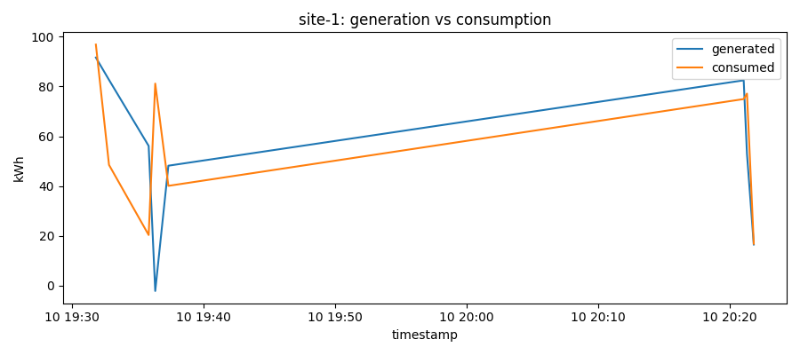
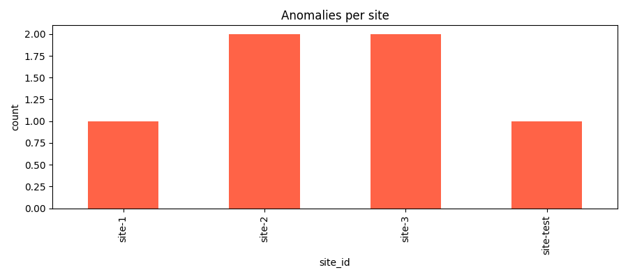
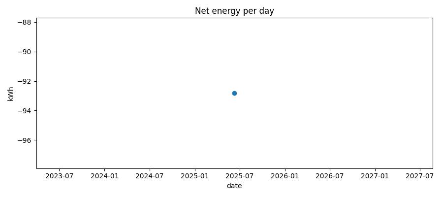

# ⚡ Renewable-Energy Data Pipeline

> **Goal:** is to build a serverless AWS pipeline that ingests site telemetry, enriches it in real time, flags anomalies, and makes the data queryable via a FastAPI endpoint.

---

## 🛫 Pre-Day 0 – Project Setup & Environment

| Step | Action |
|------|--------|
| **1** | **Clone the repo**: `git clone https://github.com/<you>/data-pipeline-project.git && cd data-pipeline-project` |
| **2** | **Install tooling**<br>• AWS CLI configured with an IAM user that can create S3, Lambda, DynamoDB, SNS.<br>• Terraform ≥ 1.5<br>• Python ≥ 3.11 |
| **3** | **Create a virtual env** and install dependencies:<br>`python -m venv .venv && source .venv/bin/activate && pip install -r requirements.txt -r requirements-dev.txt` |
| **4** | **Verify AWS creds**: `aws sts get-caller-identity` should succeed. |


---

# Day 1 Status

## Prerequisites
- AWS account with CLI configured
- Homebrew, AWS CLI, Python 3, Terraform installed

## Terraform Infra
- **S3 bucket:** `$(terraform output -raw data_feed_bucket_bucket)`
- **DynamoDB table:** `EnergyData`
- **Lambda function:** ProcessEnergyData stub

## Test
1. `echo '{"site_id":"site-test","timestamp":"2025-06-06T00:00:00Z"}' > test.json`
2. `aws s3 cp test.json s3://YOUR_BUCKET/test.json`
3. `aws logs tail /aws/lambda/ProcessEnergyData --since 2m`

Lambda logs “pong” event successfully.

---
#### Day 2 Verification
- 17 records in DynamoDB  
- 3 anomalies detected (`anomaly = true`)  
- Example anomalous item:

```json
{ "site_id": "site-3", "timestamp": "2025-06-10T20:00:00Z", "energy_generated_kwh": -10, "energy_consumed_kwh": 20, "net_energy_kwh": -30, "anomaly": true }
```

### Day 3 – Alerts & Insights
1. Add Amazon SNS e-mail alert for anomalies  
2. Generate three starter charts (energy vs consumption, anomaly count, net-energy trend)  

#### Day 3 – Visualizations

| Chart | Sample |
|-------|--------|
| Generation vs Consumption (site-1) |  |
| Anomalies per Site |  |
| Net Energy Trend (daily) |  |

### Day 4 – API Layer
Goals  
1. FastAPI service with `/records` & `/anomalies`  
2. Interactive docs via Swagger UI  
3. Sample queries & README update  

### Day 5 – CI/CD & Polish
1. GitHub Actions workflow (lint + tests + terraform apply)  
2. Build-status badge  
3. Teardown / cost-cleanup checklist  


### Day 6 - End-to-End Verification, Testing & Troubleshooting
## 1. Dependency & Environment Fixes
Aligned Python versions between local dev and Lambda/Terraform (e.g., Python 3.11).

Virtualenv setup:
```bash
    python3 -m venv .venv_dev
    source .venv_dev/bin/activate
    pip install --upgrade pip
    pip install -r requirements.txt
    pip install -r requirements-dev.txt
```

Requirements changes:

a. Requirements.txt
```text
    fastapi==0.115.12
    mangum==0.19.0
    pydantic==2.11.5
    httpx
```

b. requirements-dev.txt
```text
    pytest>=7.0
    pytest-cov
    moto>=5.1
    black
    flake8
    typing-extensions>=4.8.0
    httpx
    # any other dev dependencies
```

## 2. Fix Import & Testing Issues

a. API Test: 
- Installed httpx so that fastapi.testclient works without errors.

- Adjusted Moto mocking imports: switched to from moto import mock_aws (newer Moto uses mock_aws context manager rather than individual mock_dynamodb2, etc.).

- Ensured environment variables (AWS_REGION, AWS_DEFAULT_REGION, AWS_ACCESS_KEY_ID, etc.) are set in pytest fixtures so boto3 uses the Moto mock rather than real AWS.

b. Lambda code package: 
Added lambda_function/__init__.py exporting lambda_handler so that from lambda_function import lambda_handler works in tests and in Terraform package.

c. Python version mismatch:
Verified local uses same runtime version (3.11) as Terraform/Lambda, avoiding cryptography/Moto import errors.

## 3. CI/CD Workflow updates
a. deploy.yml (GitHub Actions) changes:

    - Ensure Python 3.11 is used.

    - Install dev dependencies including httpx, pytest, moto, flake8, black.

    - Re-enable pytest step:

    ```yaml
        -   name: Run unit tests
            env:
                AWS_REGION: us-east-1
            run: |
                source .venv/bin/activate
                pytest --cov=. -q
    ```

    - Cache pip based on both requirements.txt and requirements-dev.txt to speed up installs.

    - Build and package the API Lambda with its runtime dependencies in api_lambda_build or similar, ensuring fastapi, mangum, pydantic, httpx (if needed) are included.


### 4. Terraform Changes
# a. Added SNS Topic for anomaly alerts in `main.tf`:

    ```hcl
        resource "aws_sns_topic" "alerts" {
            name = "EnergyAlerts-${random_id.suffix.hex}"
        }
        output "alert_topic_arn" {
            value = aws_sns_topic.alerts.arn
        }
    ```

# b. Processor Lambda environment: set SNS_TOPIC = var.alert_topic_arn.

# c. variables.tf: default or override for alert_topic_arn

    ```hcl
        variable "alert_topic_arn" {
            description = "SNS topic ARN for anomaly alerts"
            type        = string
            default     = ""  # can override via CLI or CI; Terraform plan/apply will create the topic and set this output
        }
    ```

# d. Workflow injects the new alert_topic_arn into Terraform plan/apply.

# e. Verified terraform init, terraform plan, terraform apply succeed without errors.


### 5. SNS Subscription Verification

1. After Terraform apply, capture outputs:

```bash

    export ALERT_TOPIC_ARN=$(terraform output -raw alert_topic_arn)
    export BUCKET_NAME=$(terraform output -raw bucket_name)
    export TABLE_NAME=$(terraform output -raw dynamodb_table_name)
    export API_ENDPOINT=$(terraform output -raw api_endpoint)

```

2. Subscribe your email (if not already) and confirm:

```bash
        aws sns subscribe \
            --topic-arn "$ALERT_TOPIC_ARN" \
            --protocol email \
            --notification-endpoint nikhil.bhoopalam@gmail.com
        # Check status:
        aws sns list-subscriptions-by-topic --topic-arn "$ALERT_TOPIC_ARN"
```

    - If you see "SubscriptionArn": "pending confirmation", check your email inbox/spam for the AWS confirmation link and click it.

    - After confirmation, list-subscriptions-by-topic should show a real ARN (not pending).

    - Optionally test:

    ```bash
        aws sns publish --topic-arn "$ALERT_TOPIC_ARN" --subject "Test SNS" --message "SNS alert test"
    ```
    You should receive this email if confirmed.


### 6. Locally smoke test (Before CI)
1. Upload sample records to S3:
```bash
    # Non-anomaly
    echo '{"site_id":"smoke-site","timestamp":"2025-06-13T12:00:00Z","energy_generated_kwh":42.0,"energy_consumed_kwh":10.0}' > test1.json
    aws s3 cp test1.json s3://$BUCKET_NAME/test1.json
    # Anomaly
    echo '{"site_id":"smoke-site","timestamp":"2025-06-13T12:05:00Z","energy_generated_kwh":-1.0,"energy_consumed_kwh":5.0}' > test2.json
    aws s3 cp test2.json s3://$BUCKET_NAME/test2.json
```

2. Monitor Processor Lambda logs:

```bash
    aws logs tail /aws/lambda/ProcessEnergyData --follow
```


    - Confirm each upload triggers the Lambda, writes to DynamoDB, and for anomaly, prints “📣 anomaly alert sent”.

    - Confirm no errors in logs.


3. Verify DynamoDB entries

```bash
    aws dynamodb scan --table-name "$TABLE_NAME" | jq .
```
    - Ensure records appear with correct attributes (energy_generated_kwh, energy_consumed_kwh, net_energy_kwh, anomaly).

4. Monitor for SNS email:

    - After anomaly upload and Lambda log confirms publish, check your email for alert.

5. Test API Lambda:

    a. Inspect API logs:

```bash
    aws logs tail /aws/lambda/EnergyDataAPIHandler --follow
```

    b. Invoke endponts: 
```bash
    curl "$API_ENDPOINT/records?site_id=smoke-site" | jq .
    curl "$API_ENDPOINT/anomalies?site_id=smoke-site" | jq .
```

    c. If you see "Internal Server Error", check CloudWatch logs for the stack trace, fix missing env vars or permissions, redeploy code or adjust IAM policies.

    D. Once fixed, the endpoints should return JSON arrays (possibly empty or with the expected records).

7. CI Smoke Test Integration
    - In GitHub Actions workflow (deploy.yml), after Terraform apply on main:

```yaml

- name: Smoke test API endpoint (verbose)
  if: github.event_name == 'push' && github.ref == 'refs/heads/main'
  env:
    AWS_REGION: us-east-1
  run: |
    set -euo pipefail
    RAW_OUTPUT=$(terraform output -raw api_endpoint)
    ENDPOINT=$(printf "%s\n" "$RAW_OUTPUT" | grep -Eo 'https://[^: ]+' | head -n1)
    echo "Using endpoint: $ENDPOINT"
    # Wait a bit for propagation
    sleep 5
    # Non-anomaly test
    RESPONSE=$(curl -s -w "\n%{http_code}" "$ENDPOINT/records?site_id=ci-test")
    echo "$RESPONSE" | head -n1 | jq . || true
    echo "Status code: $(echo "$RESPONSE" | tail -n1)"
    if [ "$(echo "$RESPONSE" | tail -n1)" != "200" ]; then
      echo "Smoke test records failed"; exit 1
    fi
    # (Optionally: upload a temp object, but CI cannot write to S3 in many cases; skip or mock)
```

    - Ensure httpx is installed in API Lambda package if your tests or code uses it.

8. Logging & Monitoring
    - CloudWatch Logs: always check /aws/lambda/ProcessEnergyData and /aws/lambda/EnergyDataAPIHandler after deploy.

    - CloudWatch Metrics / Alarms (future): consider adding alarms on Lambda errors or SNS delivery failures.


9. Cleanup & Teardown
    Run terraform destroy to remove all resources; verify S3 bucket, DynamoDB table, Lambdas, API Gateway, and SNS topic are deleted.


    

